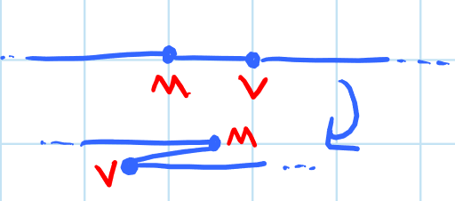

## pcbch project, Samuel Schuur, 2020

Lets start with a proof: given a sufficiently large piece of (bicolor)
paper we can fold any "connected union of polygons in 3D with a specific
color on each face." In simpler terms: we are going to prove that any
shape that we can make by combining polygons (it's easy to think about on
a flat surface, but we can also combine polygons in 3D space) we can fold,
and if our paper has a different color on either side, we can pick each of
the polygons we have unioned to be that color. 

However before we start the proof lets define some basic terms in origami:

- A piece of *paper* is a 2D polygon (most traditionally a square) with
  a distinguishable top and bottom (this is why bicolor paper is often
  used).
- A *crease* is a line segment or curve on that paper which we can fold
  along. Along a crease we can make either a *mountain* (denoted by
  a dot-dash line or a red line) or a *valley* fold (denoted by a dashed
  line or a blue line). If we imagine a piece of paper on a table with
  a crease down the middle, a valley fold is a fold where the top faces of
  the paper come together, and a mountain fold is a fold where the bottom
  faces come together.
- A *crease pattern* is a collection of creases on a paper, and
  a *mountain-valley assignment* is a *crease pattern* where creases are
  specified to be either mountain or valley.
- A *folded state* is the resulting origami after all of the folds in
  a *crease pattern* are made (conversely we can consider the unfolding of
  a folded state to yield a *crease pattern*). If a folded state lies
  entirely in a plane it is a *flat folding*
- Finally *simple folds* are folds along a straight line by +/- 180
  degrees.

**An example crease pattern, with a mountain-valley assignment (for a paper airplane!):**

# Strip Folding

For our proof we shall consider a strip of paper (so not very wide,
relative to it's length) though it doesn't have to be initially, after all
by accordion folding it is very easy to turn most rectangular paper into
such a strip. For this proof let us also only consider the case where we
have a union of polygons in 2D, afterwards it will be easy to see it apply
to three dimensions as well. In this 2D case we will only have to use
*simple folds* (side note, the title font for this page, designed by Erik
Demaine is made entirely using simple strip folding, though a different
technique than seen here). 

For this proof we will use two "gadgets," a common idea in algorithmic and
folding proofs, a "gadget" is a kind of tool, in this case a series of
folds, to achieve a desired outcome which we will use repeatedly
throughout the proof.

The first gadget we call a "turn gadget," by first folding a simple
mountain fold perpindicular to the edge of paper and then by taking the
back layer of that same paper and making a simple valley fold along a line
perpindicular to the direction we want the strip to point in and through
one of the two points where our 1st moutain fold intersected the edge of
the strip (depending if our desired direction is "up" or "down") we can
get our strip to turn in any direction we like.

**Turn Gadget**

The second gadget we call a "color-reversal gadget," by folding a simple
mountain fold perpindicular to the edge of the paper and then folding the
bottom layer along a valley fold 45 degrees to the edge of the paper and
through one of the points of intersection of orignal mountain fold and the
edge, and then making a similiar fold to now the 2 back layers of paper
but through the other point of intersection, we have a fold where the
paper continues in the same direction it was originally but with the back
side facing up now.

**Color-Reversal Gadget:**

The gist of this proof then is that we take our strip of paper and we wrap
it around our polygons using our turn gadget, and when we want our faces
to be a differnt color we use our color-reversal gadget. More formally our
first step is to take our shape and triangulate it, there are effiecient
algorithms to do this but an easy way is to just continue to connect
vertices of our polygon (such that they dont cross other placed lines)
until we have polygonal faces remaining). We then pick an order to visit
the triangles in (we can visit each triangle more than once, but if we
want to be efficient with paper usage, this becomes a traveling salelman
problem). Starting at the vertex of a triangle opposite the edge shared
with the triangle we want to visit next, we zig zag or strip across the
triangle such that is stays parallel to the edge we want to visit next (so
that we end up at one of the vertices of the edge we are parallel to)
using two turn gadgets every time the strip exits the bounds of the
triangle to move our strip over one width amount and to be traversing
parallel the opposite way (this is easiest to see in the diagram). When we
get to one of the vertices of the next triangle we want to visit we use
a turn gadgets to become alligned to once become alligned parallel to the
shared edge with the next triangle we want to visit, and repeat until we
have finished covering the surface of the polygon). If we ever want
a triangle to be a different color we simply use the color-change gadget
as we transition on to that triangle. Finally we can notice that though we
have covered the entire surface area of the polygon our strips actually
over hand the edges where we have done the turn gadgets we can hide the
excess paper underneat each trinagle by doing successive mountain folds
along the edges of the triangles until we only have the desired shape
remaining. 

**Strip folding in action:**

From this we can see that by following this method we can fold any 2D
union of polygons, and if we consider our turn-gadget briefly we can see
by choosing to not make the final fold a simple fold but instead let us
leave it at an arbitrary angle "up," if we image the strip upside down on
the table, we can see how this same method would work in 3D. 

Surpsingly this algorithm can be quite efficient, as we decrease the width
of our strip the amount overhanging (the wasted paper) decreases (as it is
only the width of our strip of paper), so as our paper gets arbitrarily
thin our wasted paper usage gets arbitrarily low as long as we only visit
each rectangle once. There are several cool methods to show that we only
have to visit each triangle once, but one that is really easy to
understand, is if we consider our strip of paper to be infinitely thin we
can actually pick any random order of triangles to visit and go straight
to each one without regards to an efficient path. Since in this case our
paper is infinitely thin we actually waste no paper doing this. 

# Origamizer

Now this is a very cool proof, and was in fact one of the first big
results in compational origami, but it feels a little bit like cheating in
that though it can be very efficient it's really a pain to practically
fold anything complicated with this method and beyond this nothing is
particularly structurally sound that we fold, its just a strip of paper.
Therefore we are next going to look at an algorithm called Origamizer
which allows allows us to fold an 3D polyhedron (but in a more practical
way), such that every convex face is seamless (has no holes in it, which
though is theoretically possble by the strip method by using very wide
strips, really hurts it's effieciency) and such that the entire folding is
watertight (that is there are no holes in it at all, it could hold water,
the edge of the paper only goes around the boundary of the surface, not
through it). This algorithm is quite difficult to prove but not very hard
to understand. 

The idea is that we that a large sheet of paper and upon it we place all
the convex faces of the polyhedron, by valley folding once and mountain
folding twice between connected edges we can "tuck" faces together, and
the flap that brought the faces together remains on the inside of the
polyhedron. If we consider what happens at vertices where we may have
three or more faces coming together the folding is much less obvious, but
we can develop a "tuck" gadget that works for brining all of the vertcies
of a polygon to a single point which we can use here (we end up folding
along a voronoi diagram to do this which is quit neat). The one main thing
we have to be careful of here is that the "tucked" flaps dont intersect
eachother within the polyhedron or even the surface of the polyhedron on
the other side of the model. 

**A *mountain-valley assignment* generated by Origamizer:**

**An animation of how the faces get brought together by Origamizer:**

**BONUS:** Heres a video of Tomohiro Tachi folding a Stanford Bunny (a famous 3d model) from a pattern from Origamizer: https://www.youtube.com/watch?v=GAnW-KU2yn4

This algorithm provides a better way to fold any polyhedron, and certainly
a more structurally sound result, but it is still quite slow to fold and
so consequently is used infrequently in practice it is also difficult
computationally to come up with an efficient way to lay out all of the
inital faces of the polyhedron to be efficient with paper usage even if it
is theoretically possible (in a bit we will talk a little more about
computational hardness of folding algorithms).

So far we have talked about two algorithms to fold most anything, the
first efficient but structurally unsound and complicated to fold, the
second more structurally useful, but still slow to fold and hard to be
efficent with. Now we will end with a final algorithm called Tree Maker
which though theoretically less versatile, is practically much more useful
and is actually used by most professional origamists for many complicated
designs, here we can see some examples of things folded using Tree Maker.

**A little tase of what Tree Maker can do: Nazgul 8.1 by Jason S. Ku and Roosevelt Elk by Robert Lang:**

Before we get there however lets take a closer look at crease patterns and
flat foldability, basically understanding a little better what makes
something possible to fold in the first place.

# 1D Folding

We start our journey by understanding 1D foldability, perhaps somewhat
counterintuitively after all paper is 2D, but gaining an idea of 1D
folding will let us understand 2D folding much better. In 1D we have to
shift some of our definitions a little bit (in fact 1 dimension down), in
1D our *paper* is a line segment, our *creases* just points on that line
segment, and our *crease patterns* just collections of points.

A simple thing to think about here, is given a *crease pattern* is it flat
foldable? For now we won't care about *mountain-valley assignments.* In
the case of 1D folding this is quite easy, given any *crease pattern* we
can by simply alternating *mountain* and *valley* folds every crease
pattern in 1D is flat foldable. This is actually pretty easy to visualize,
by repeating mountain valley folds we simply "accordion" our piece of
paper and it is clear that it will never self intersect, it never can fold
back on itself. 

However if we add a *mountain-valley assignment* to the mix things become
more complicated, for example if we have a long strip of paper with
a short segment in the middle bounded by two valley folds, if we try to
fold this it is easy to see that two longer segments will intersect, this
means this pattern is not flat foldable. So now lets look at how we can
figure out what *mountain-valley assignments* are flat foldable.

**A bad mountain-valley assignment:**

To do this we define two new folds: an *end fold* is a fold where the
distance to the end of the paper from a crease is greater than or equal to
the distance to the next crease: visually this means we can fold the end
over without worrying about covering a crease which if folded the wrong
way could cause self intersection. We also define a *crimp* which is where
we have a mountain and a valley crease, and the distance between these two
creases is less than or equal to the distance to the next crease on either
side. This fold, illustrated below, also preserves flat foldability. The
crimp brings two layers of paper on top of each other which we can almost
consider to be glued together, just a single strip of paper, and since the
distance to the next folds are further then the distance betweent the two
crimped folds, there is no risk of them intersecting the crimp. We can
consider the crimped paper to form a new sheet of paper minus the two
crimped creases, and with a shortened overall length. 

**A crimp:**

Since borth *crimps* and *end folds* don't cause any risk of intersection,
our piece of paper after we perform these folds is stil flat foldable.
Therefore if we want to check if a pattern is flat foldable we simply
continuosly *crimp* and *end fold* our paper, until the paper is entirely
folded, in which case it is flat foldable or we run into an intersection
or can *crimp* and *end fold* no longer in which case it is not. Since
every *crimp* and *end fold* is flat foldable it doesn't matter what order
we do this in, if we have an issue with our folding it won't come from
either *crimps* or *end folds* but some other self intersecting, or
otherwise bad fold. 

This logic continues to work in simple 2D cases as well, if we simply have
a strip of paper instead of a segment the argument continues to work,
furthermore if we have a 2D sheet where we only have creases perpindicular
to each other the argument continues to work, we simply fold all of the
creases going one way by our rule, and then all those going the other way. 

However if we try to abstract this argument any further we begin to run
into issues, if we want to move into 2D folding properly we need to
consider single vertex folding. 

# Single Vertex Folding
Single vertex folding is simple as well: we image a circular disk of paper
with creases emenating from the center. The idea is that this allows us to
understand foldaibility around a vertex in a larger crease pattern. How
we consider folding this strip is very cool, if we consider the
circumference of the disk as a wrapped line segment and where the creases
intersect the circumference as points, we can all of a sudden just see our
single vertex problem as just a 1D folding problem, we just need to pick
a location to "split" our circumference. The other stipulation is that we
need to be able to rejoin our circumfrence at the end, so to be flat
foldable our two ends must end up at the same location "vertically," if we
consider the paper stacking up (this is easiest to understand visually in
the diagrams below). For this reason we choose to cut the circumfrence at
the "extreme" crease (for example the leftmost if we consider the diagram
below), the one furthest from other creases, therefore when we rejoin the
paper at that crease this rejoining doesnt intersect other folds. 

To this end we have two theorems that are required for a single vertex
fold to be *flat foldable.* To understand them we hae to realize that the
length of line segments between crases in our 1D folding correspond to the
central angles of our vertex fold:

- Kawasaki's theorem says that the sum of all of the odd angles, must
  equal the sum of all of the even angles which also must equal 180
  degrees. This is easiest once again to understand by looking at the
  diagram below but the deal is that angles corespond to distances
  traveled between creases, in our 1D folding, and creases are where we
  switch direction. Thefore to end up where we started the odd and even
  creases must equal eachother, the left and right "switchbacks" must
  cancel eachother out. Also since all of the central angles mush sum to
  360 degrees, each "half sum" must equal 180 degrees.

- Maekawa-Justin's theorem says that the number of mountain creases, minus
  the number of valley creases must equal +/-2. If we once again look at
  the diagrams below we see that for our ends to end up on the same side
  to join up again we need 1 more either mountain or valley crease (valley
  in the diagram below) so that our ends match up. Then we just have to
  realize where our ends join is also a crease, in our diagram we can see
  that since it brings the inside face of our loop together (what I have
  been considering the top) it is also a valley fold, it brings us to +2
  valley folds. It's easy to see how this works out in other cases, it's
  and easy and satisfying proof to look at cases for. 

These are fun visual proofs, but by far the coolest thing about them is
how quickly you can demo / "prove" them practically. If you have been
working along on a bit of scrap paper to sketch out and show more cases of
the above theorems to understand them better I recommend crumpling it up
(it's very satisfying to crumple up confusing bits of work), but not into
a ball, crumple your paper against the table. If you know unfold this
crumpling flat, you can look at all of the little folds you have created
and trace them out, and visually see that all of them follow both
Maekawa-Justin's and Kawaski's theorems.

**An 1D "unwrapping" of a single vertex fold:**

Another good demo of these proofs is to fold 3 mountain folds on a page
all 120 degrees aprart, this won't fold flat, but notice what you have to
do flatten it. If you draw a triangle between the end of the three
original folds, you can notice some cool properties of the folds relative
to the triangle. What you have just folded is a basic variation of
something we will use later called a *rabbits-ear molecule.*

**Crumpling demonstrates our theorems!**

**Where to fold to make flat?**

After we add these two truths, seeing if a vertex will fold flat follows
all the same logic 1D folding here, except since we have a loop we can no
longer *end fold* so keeping in mind the above theorems we just
continuously crimp until either we run into an issue or it works. 

# "Chasing folds"

Given we now know what must be true for a vertex to fold flat we can begin
to look at how whole 2D crease patterns by checking, that all verticies
fold flat. From our above work we can recognize where crimps can occur, in
this case must occur (we have to have crimps for our vertices to fold
flat), and since in crimps we must have both *mountain* and *valley* folds
we can begin to figure out creases must not be equal (must be of opposite
asignment), the other bit of knowldge we have is that creases between
vertices must be the same fold type (a crease cant transitions from
*moutnain* to *valley* between vertices) and so armed with this
information we can (kind of like how we used to "chase angles" in
geometry) move throughout our crease patterns and "chase folds," to figure
out what folds must be what in order for a crease pattern to fold flat.
A simple example of a fold that is clearly not possible by this method is
shown below. The other tricky thing here is sometimes we have multiple
possible crimp patterns and sometimes performing these crimps joings new
vertices together that hadn't been previously joined. It's a complex
proof, but the basic algorithm goes, that if we can we should try to join
as many vertex "loops" together and "chase folds" until we either run into
an issue or the whole thing is locally flat foldable.

# NP Hardness 

The above method might seem like enough to check if any 2D *crease
pattern* is foldable, and for the most part (it checks for local
foldability, that is at least each vertex folds flat) it does in fact work
for most all origami anyone might want to fold practically. To understand
this we need to introduce the concept of NP hardness, it's a complicated
topic but to sum it up simply, an NP hard problem is a problem where any
algorithm to solve the problem is not any more (computationally) efficient
than simply trying all the possible solutions. An NP hard problem is
therefore "computationally intractable." There are two classes of NP hard
problems, weak NP hard problems, and strong NP hard problems. Weak
problems are only NP hard for large numbers, while strong NP hard problems
are NP hard for all numbers (this of course all assumes P != NP, which is
a problem beyond the scope of this writing, but quite neat, everyones
assumes it to be the case but no one has proven it yet; however if you did
you could win a million dollars from the Clay mathematics institute).

We can in fact show that checking if any 2D *mountain valley assignment*
is flat foldable is strongly NP hard. This is also a quite complicated
thing to prove, but uses some really neat techniques, so I'll recount it
briefly here. Almost all NP hardness proofs are structured the same way,
we prove that a subset of our problem is a problem that has already been
shown to be NP hard, and so since it is a subset of our problem, our
problem must be at least as hard as it. For this problem we reduce from
a problem called "all-positive not-all-eqal 3-satisfiability," a mouthfull
for sure, but not too hard to understand it basically says given some
triples is there a boolean assignemnt to the variables in the triples so
that none are all true or all false. 

What we end up doing is constructing "analog circuitry" out of our
origami, we make a gadget for a wire where if folded one way it is true,
and another false, a gadget that lets us split and redirect our wire, and
finally a gadget with three wire inputs that can not be folded if all
wires are true or all are false. With these tools we can represent our
base problem in origami, and so it is strongly NP hard. Below is a diagram
of the setup. However to me the coolest part of all of this is the idea
that we can build analog logical circuitry out of origami (it makes me want to make a little calculator entirely out of paper!).

**The "circuit" used to prove NP-hardness:**

# Tree Maker

Now we finally, have arrived at the promised algorithm, Tree Maker, what
Tree Maker does is much simpler compared to our previous algorithms but
much more useful to origamists. Tree maker "finds the folding using the
smallest possible square of paper into a "uniaxal" origami bsae whose
projection is a desired metric tree." What this means is that given
a "metric tree" basically a stick drawing with "sticks" of specified
lengths Tree Maker makes a folding whose projection onto a 2D plane is
that base. Tree Maker is a hard algorithm to do optimally, but it has
a relatively easy methodology to follow, so below I will demonstrate how
we can perform TreeMaker (even by hand). 

But first a challenge problem which we can take a look at again afterwards
through the lens of TreeMaker. This problem is called **Marguli's Napkin
Problem**. It asks us to prove that given a unit square of paper, no
matter how we fold it, the perimeter always decreases. (Heres a bit of
virtual paper to play with: https://beta.rabbitear.org/diagram/ which even
generates a little crease pattern (I tried really hard to bake in some
interactive examples with this into this doc, but my javascript skills
arent so great so I wasn't able... sorry...)).

While you think about that, Tree Maker: 

First we define some more parts of a uniaxal base, a uniaxial base is
composed of *flaps*, all that project to a line segment in our tree, at an
intersection of two flaps we have *hinge creases* which project to points
in our tree, *leaves* are vertices of our tree that only connect to the
tree on one *flap*, and we stipulate that only one point of paper folds to
each leaf.

**Uniaxial Base & it's projected tree:**

We also need to introdo a lemma, the distance between any two points on
our tree must be less than or equal to that same distance on our actual
paper (before we fold it into our uniaxial base). Basically this
stipulates that we cant stretch paper, we can only keep constant or
decrease the distance between points on our paper.

So the steps to Tree Maker: 

1. Since our leaves only project to a single point on our paper we first
   place the leaves on our paper, subject to the lemma above, ideally we
   place them as close to equal to the distance on our tree as possible to
   be efficient with paper usage (a disk packing problem, which also
   happens to be NP hard, disk packing is also a hint for Margulis.
   Basically we create disks with radius's equal to the length of the tree
   branch for a specific leaf, and we try to pack them as tightly as
   possible; as many tangent as possible).

2. Next we want to draw segments connecting all of our leaf points.
   Ideally our leaf arrangement is such that by drawing these segments in
   we trianglulate the page (if this isn't the case we can actually add
   extra flaps that just fold flat against our base, simply to triangulate
   the page though we won't deal with that here. Also more complicated
   variations of this algorithm can deal with any convex polygon instead
   of just triangles).

3. Next we want to place hinge creases, we know hinge creases project to
   non leaf points in our tree, and we know the relative distance along
   the tree between such hinge points and leaf points, so what we do now
   is we draw in points for our hinges along the segments connecting our
   leaves, the correct relative distance that we determined from our tree.

4. Finally we turn all of our triangles into "rabbit-ear molecules" (or
   Lang universal molecules, if we only bothered with convex polygons).
   A rabbit ear molecule is what we folded when we did the demo, during
   single vertex folding (the one with three 120 degree angles). First we
   define all the edges of our triangles and make them *valley folds* (we
   could also reverse everything), next we draw in the angular bisectors
   to those triangles, making them mountain folds, finally we add in
   perpindiculars to the incenter (the step we performed in the demo) and
   make them valley folds. Also in an extra step here at each hinge point
   we draw in perpindiculars to the angular bisectors, and make them
   valley folds. 

And thats it, Tree Maker, it can be tricky to do by hand but luckily
Robert Lang the developer of the Tree Maker method, made a great piece of
software by the same name that automates this for us (among much more).
Below is an example of a crease pattern made by Tree Maker and it's
corresponding uniaxial base to help with understanding. 

I recommend trying a simple example of this on a piece of paper just to understand this a little better, it's hard to wrap ones head around it all just by reading.

**Base and Fold Pattern:**

Finally, just to drive home the power of treemaker, heres a super cool animation I made, of a design of Robert Lang's
also made with the Tree Maker technique of a little dragon
(https://langorigami.com/artwork/knl-dragon-opus-132/) being folded.

**Oh and Marguli's problem:**
Turns out it's impossible to prove! By packing a whole lot of disks onto our square of paper and using tree maker techniques we can make a very spiky tree with an arbitrarily large perimeter! This is a pretty fun and nonintuitive result we can get from TreeMaker.

*Credits:*
Most all of my research for this came from Erik Demaine's class Geometric Folding Algorithms and Linkages, many of the images in this came from the notes for that class, and the textbook of the same name. The rest of the images were made by me by taking photos or using several wonderful pieces of open source software to generate the crease patterns and animations on this page. These incluse Robby Kraft's rabbit-ear library, Amanda Ghassaei's origami simulator, Robert Lang's treemaker, and Tomohiro Tachi's origamizer. 

*Thanks for reading, theres a lot more to learn here, I had a lot of difficulty editing what to stick in here so if you have any interest at all I recommend checking out any of the referenced people!*
